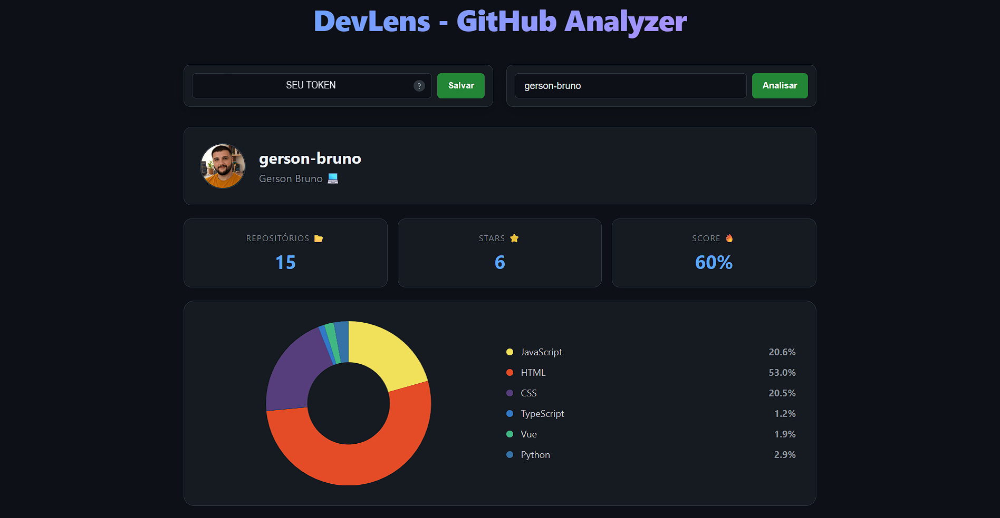

# 🔍 DevLens - GitHub Insights

O **DevLens** é uma ferramenta de análise de perfil do GitHub que transforma dados brutos da API em visualizações inteligentes. O projeto foca em fornecer uma visão clara das tecnologias dominantes de um desenvolvedor, seu engajamento (stars) e uma pontuação de performance baseada em sua atividade.

---

## 🚀 Demonstração
Acesse o projeto online: [**Clique aqui para visualizar o DevLens**](https://gerson-bruno.github.io/devlens/)

---

## 📸 Preview


---

## ✨ Funcionalidades

* **Dashboard de Linguagens:** Gráfico interativo (Doughnut) mostrando a distribuição percentual de tecnologias.
* **Cores Dinâmicas:** Sistema de cores que identifica linguagens populares ou gera cores únicas via algoritmos de Hashing.
* **Integração com API GitHub:** Consumo de dados de usuários, repositórios e estatísticas de linguagens em tempo real.
* **Suporte a Token:** Campo dedicado para inserção de Personal Access Token, evitando limites de taxa (Rate Limit) da API.
* **Design Responsivo:** Interface otimizada para Desktop e Mobile com tema Dark (estilo GitHub).

---

## 🛠️ Tecnologias Utilizadas

* **Vue.js 3:** Framework progressivo para a construção da interface.
* **Vite:** Build tool ultra-rápida para o desenvolvimento.
* **Chart.js:** Biblioteca de manipulação de dados para geração de gráficos.
* **Axios:** Para requisições HTTP eficientes.
* **CSS3 (Flexbox/Grid):** Layout moderno e responsivo sem dependências externas de UI.

---

## 📦 Como rodar o projeto localmente

1. **Clone o repositório:**
   ```bash
   git clone [https://github.com/gerson-bruno/devlens.git](https://github.com/gerson-bruno/devlens.git)
2. **Instale as dependências:**
   ```bash
   npm install
   ```

3. **Inicie o servidor local:**
   ```bash
   npm run dev
   ```
## 🔑 Como criar seu GitHub Personal Access Token
Para usar o DevLens sem restrições de limite de busca, siga estes passos:

Acesse as Configurações: No seu GitHub, clique na sua foto de perfil no canto superior direito e vá em Settings.

Developer Settings: No menu lateral esquerdo, role até o final e clique em Developer settings.

Tokens (classic): Clique em Personal access tokens > Tokens (classic).

Gerar Novo Token: Clique no botão Generate new token > Generate new token (classic).

**Configuração:**

Note: Dê um nome (ex: "DevLens App").

Expiration: Escolha o prazo que preferir (ex: 30 ou 90 dias).

Scopes: Para o DevLens, você não precisa marcar nenhuma caixa (o acesso público é suficiente para ler repositórios abertos).

Gerar: Role até o final e clique em Generate token.

Copiar: Copie o código gerado imediatamente (ele começa com ghp_). Atenção: Você não conseguirá vê-lo novamente após fechar a página.


## 👨‍💻 Sobre o Desenvolvedor
Projeto desenvolvido por Gerson. Estudante de Análise e Desenvolvimento de Sistemas na UNINTER e Residente em TIC-12 pela UFC. Atualmente em transição de carreira para Front-End Developer, unindo a precisão de 8 anos como fisioterapeuta com a paixão pela tecnologia e código limpo.

## 📝 Licença
Este projeto está sob a licença MIT.